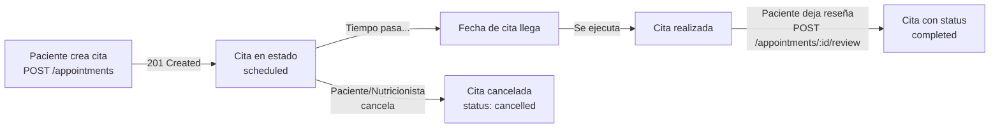

# Módulo de Appointments (Citas y Reseñas)

## Descripción General

El módulo de Appointments permite gestionar la vinculación entre pacientes y nutricionistas. Incluye la creación de citas, visualización del calendario y gestión de reseñas posteriores a la atención.

---

## 🔐 Autenticación

**Todos los endpoints requieren autenticación JWT.**

### Header requerido:
```
Authorization: Bearer <token_jwt>
```

El token debe contener:
- `id` (UUID del usuario)
- `role` (paciente o nutricionista)
- `email`

---

## 📋 Endpoints

### 1. Crear Cita

**Endpoint:** `POST /api/v1/appointments`

**descripción:**
Permite agendar una nueva cita entre el usuario autenticado (paciente) y un nutricionista.

**Headers:**
```javascript
{
  "Authorization": "Bearer <token>",
  "Content-Type": "application/json"
}
```

**Body (JSON):**
```javascript
{
  "nutritionistId": "550e8400-e29b-41d4-a716-446655440000",  // UUID del nutricionista (requerido)
  "date": "2026-03-15T10:00:00Z",                               // Fecha ISO (requerido)
  "notes": "Tengo problemas con digestión"                      // Notas opcionales (opcional)
}
```

**Validaciones:**
- `nutritionistId`: Requerido, debe ser UUID válido y existente
- `date`: Requerido, debe ser fecha ISO válida y futura
- El nutricionista debe tener `role: 'nutritionist'`
- El usuario autenticado debe tener `role: 'patient'`

**Respuesta exitosa (201 Created):**
```javascript
{
  "success": true,
  "message": "Cita agendada exitosamente",
  "data": {
    "appointment": {
      "id": 1,
      "patient_id": "550e8400-e29b-41d4-a716-446655440001",
      "nutritionist_id": "550e8400-e29b-41d4-a716-446655440000",
      "date": "2026-03-15T10:00:00.000Z",
      "notes": "Tengo problemas con digestión",
      "status": "scheduled",
      "review_rating": null,
      "review_comment": null,
      "created_at": "2026-03-02T15:30:00.000Z",
      "updated_at": "2026-03-02T15:30:00.000Z"
    }
  }
}
```


---

### 2. Obtener Calendario

**Endpoint:** `GET /api/v1/appointments/my-calendar`

**Descripción:**
Devuelve el listado de citas asociadas al usuario autenticado.
- Si el usuario es **paciente**: devuelve todas sus citas agendadas
- Si el usuario es **nutricionista**: devuelve todas sus citas como profesional

**Headers:**
```javascript
{
  "Authorization": "Bearer <token>"
}
```

**Query Parameters:** Ninguno requerido

**Respuesta exitosa (200 OK):**
```javascript
{
  "success": true,
  "message": "Calendario obtenido exitosamente",
  "data": {
    "appointments": [
      {
        "id": 1,
        "patient_id": "550e8400-e29b-41d4-a716-446655440001",
        "nutritionist_id": "550e8400-e29b-41d4-a716-446655440000",
        "date": "2026-03-15T10:00:00.000Z",
        "notes": "Tengo problemas con digestión",
        "status": "scheduled",
        "review_rating": null,
        "review_comment": null,
        "created_at": "2026-03-02T15:30:00.000Z",
        "updated_at": "2026-03-02T15:30:00.000Z",
        "patient": {
          "id": "550e8400-e29b-41d4-a716-446655440001",
          "email": "paciente@example.com",
          "first_name": "Juan",
          "last_name": "Pérez"
        },
        "nutritionist": {
          "id": "550e8400-e29b-41d4-a716-446655440000",
          "email": "nutricionista@example.com",
          "first_name": "María",
          "last_name": "García"
        }
      },
      {
        "id": 2,
        "patient_id": "550e8400-e29b-41d4-a716-446655440001",
        "nutritionist_id": "550e8400-e29b-41d4-a716-446655440000",
        "date": "2026-03-22T14:30:00.000Z",
        "notes": null,
        "status": "completed",
        "review_rating": 5,
        "review_comment": "Excelente atención y seguimiento",
        "created_at": "2026-03-02T16:00:00.000Z",
        "updated_at": "2026-03-16T15:30:00.000Z",
        "patient": {
          "id": "550e8400-e29b-41d4-a716-446655440001",
          "email": "paciente@example.com",
          "first_name": "Juan",
          "last_name": "Pérez"
        },
        "nutritionist": {
          "id": "550e8400-e29b-41d4-a716-446655440000",
          "email": "nutricionista@example.com",
          "first_name": "María",
          "last_name": "García"
        }
      }
    ]
  }
}
```


---

### 3. Dejar Reseña

**Endpoint:** `POST /api/v1/appointments/:id/review`

**Descripción:**
Permite a un paciente dejar una reseña sobre una cita. La cita debe haber concluido (fecha pasada).

**Headers:**
```javascript
{
  "Authorization": "Bearer <token>",
  "Content-Type": "application/json"
}
```

**URL Parameters:**
- `id` (number): ID de la cita

**Body (JSON):**
```javascript
{
  "rating": 5,                                // Número 1-5 (requerido)
  "comment": "Excelente atención y seguimiento"  // Texto (opcional)
}
```

**Validaciones:**
- `rating`: Requerido, debe ser entero entre 1 y 5
- La cita debe existir y pertenecer al usuario autenticado (como paciente)
- La fecha de la cita debe haber pasado
- La cita no debe estar cancelada

**Respuesta exitosa (200 OK):**
```javascript
{
  "success": true,
  "message": "Reseña añadida exitosamente",
  "data": {
    "appointment": {
      "id": 2,
      "patient_id": "550e8400-e29b-41d4-a716-446655440001",
      "nutritionist_id": "550e8400-e29b-41d4-a716-446655440000",
      "date": "2026-03-22T14:30:00.000Z",
      "notes": null,
      "status": "completed",
      "review_rating": 5,
      "review_comment": "Excelente atención y seguimiento",
      "created_at": "2026-03-02T16:00:00.000Z",
      "updated_at": "2026-03-16T15:30:00.000Z",
      "patient": {
        "id": "550e8400-e29b-41d4-a716-446655440001",
        "email": "paciente@example.com",
        "first_name": "Juan",
        "last_name": "Pérez"
      },
      "nutritionist": {
        "id": "550e8400-e29b-41d4-a716-446655440000",
        "email": "nutricionista@example.com",
        "first_name": "María",
        "last_name": "García"
      }
    }
  }
}


```

---

## 📊 Estados de las Citas (Status)

| Estado | Descripción |
|--------|-------------|
| `scheduled` | Cita agendada, pendiente de realizar |
| `completed` | Cita realizada y concluida |
| `cancelled` | Cita cancelada |

---

## 🔄 Flujo Típico de una Cita



---


## 🚀 Endpoints Adicionales

### Obtener Detalles de una Cita

**Endpoint:** `GET /api/v1/appointments/:id`

**Headers:**
```javascript
{
  "Authorization": "Bearer <token>"
}
```

**Respuesta exitosa (200 OK):**
```javascript
{
  "success": true,
  "message": "Cita obtenida exitosamente",
  "data": {
    "appointment": { /* appointment object */ }
  }
}
```

**Respuestas de error:**
- `403 Forbidden`: No tienes permiso para ver esta cita
- `404 Not Found`: La cita no existe

---

### Cancelar una Cita

**Endpoint:** `DELETE /api/v1/appointments/:id`

**Headers:**
```javascript
{
  "Authorization": "Bearer <token>"
}
```

**Body:** No requerido

**Respuesta exitosa (200 OK):**
```javascript
{
  "success": true,
  "message": "Cita cancelada exitosamente",
  "data": {
    "appointment": {
      "id": 1,
      "status": "cancelled",
      // ... otros campos
    }
  }
}
```

**Respuestas de error:**
- `400 Bad Request`: La cita ya está cancelada / No puedes cancelar una cita completada
- `403 Forbidden`: No tienes permiso para cancelar esta cita
- `404 Not Found`: La cita no existe

---

## 💡 Consideraciones Importantes

1. **Validación de Fechas:**
   - Las citas deben tener fechas futuras
   - Las reseñas solo pueden dejarse después de que la cita haya pasado

2. **Permisos:**
   - Solo el paciente puede crear citas
   - Solo el paciente puede dejar reseñas
   - Paciente y nutricionista pueden ver y cancelar sus propias citas

3. **Relaciones de Base de Datos:**
   - Tabla `appointments` almacena todas las citas
   - FK a tabla `users` para patient_id y nutritionist_id
   - Cascada de eliminación: si se borra un usuario, se borran sus citas

4. **Validaciones de rol:**
   - El nutricionista debe tener `role: 'nutritionist'` en la tabla users
   - El paciente debe tener `role: 'patient'` en la tabla users

---

## 📝 Ejemplo de Uso Completo (Flow)

### 1. Paciente obtiene nutricionista
```bash
GET /api/v1/nutritionists
# Obtiene lista de nutricionistas disponibles
```

### 2. Paciente crea cita
```bash
POST /api/v1/appointments
Authorization: Bearer <token_paciente>
Content-Type: application/json

{
  "nutritionistId": "550e8400-e29b-41d4-a716-446655440000",
  "date": "2026-03-15T10:00:00Z",
  "notes": "Primera consulta, tengo dudas sobre mi dieta"
}
```

### 3. Ambos consultan el calendario
```bash
GET /api/v1/appointments/my-calendar
Authorization: Bearer <token_paciente_o_nutricionista>
# Respuesta: array de citas del usuario
```

### 4. Después de que la cita ocurra, paciente deja reseña
```bash
POST /api/v1/appointments/1/review
Authorization: Bearer <token_paciente>
Content-Type: application/json

{
  "rating": 5,
  "comment": "Excelente profesional, muy atento a mis necesidades"
}
```

---
